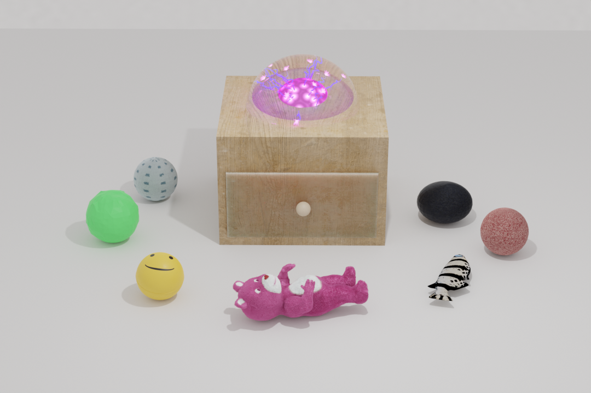
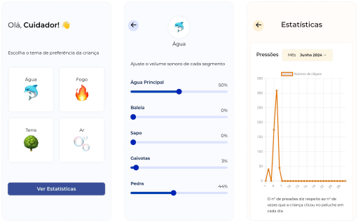
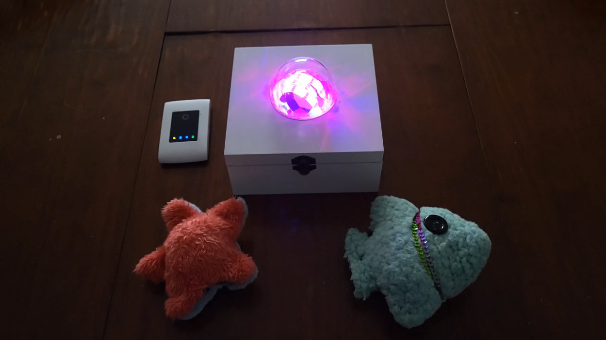

# 🧸 Snoezelen Toy: designed for children with special needs

[link to web app](https://alexandracordeiro.github.io/snoezelen-project/)

    

## Snoezelen Therapy

Snoezelen is the name given to a type of multi-sensory therapy that promotes the stimulation of senses such as sight, hearing, smell, taste and touch. 
This approach enables a connection with the world, centred on the individual and exploiting their sensory capacities, which sometimes don't come naturally.

Snoezelen therapy has positive effects on the sensory training of people with physical or cognitive disabilities, whether they are children, adults or the elderly.

## Concept

We propose an accessible and universal product that easily fits into any living room or bedroom where there is little or no light.
This product will consist of a central box, which emits light patterns, controlled by squeeze-sensitive soft toys, along with a web app dedicated to the carer where it is possible to add a sound stimuli.
With this toy we want to stimulate the senses and create an understanding of cause and effect.

## Web App

    

## Prototype

    

## Utils & Libraries

- [Cosmic JS](https://www.cosmicjs.com/)
- [Chart.js](https://www.chartjs.org/)
- [Arduino Documentation](https://docs.arduino.cc/)
- Arduino IDE Libraries
  - MQTT by Joel Gaehwiler
  - FastLED by Daniel Garcia
